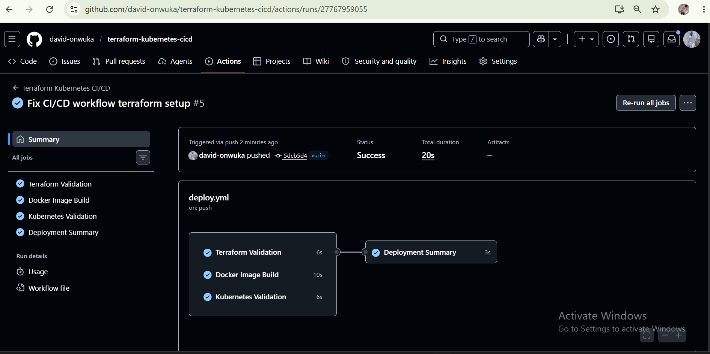
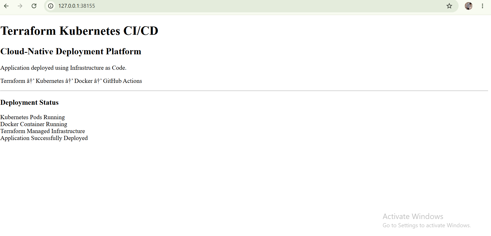
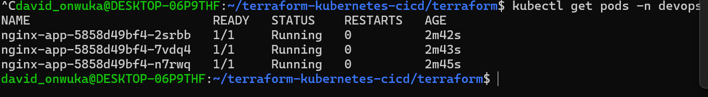
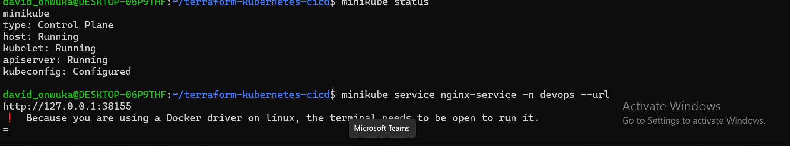
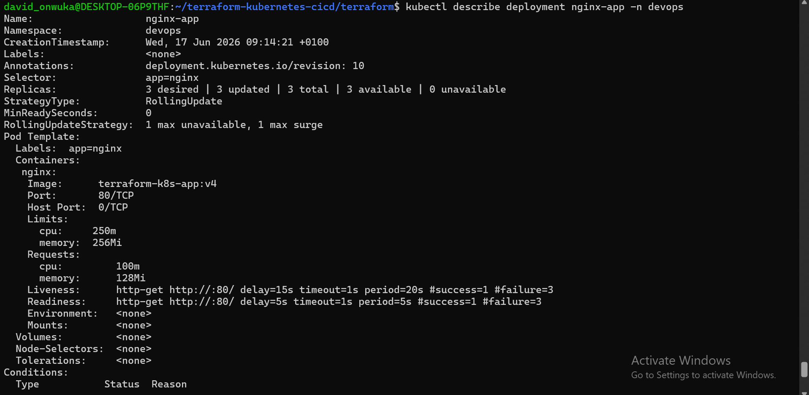
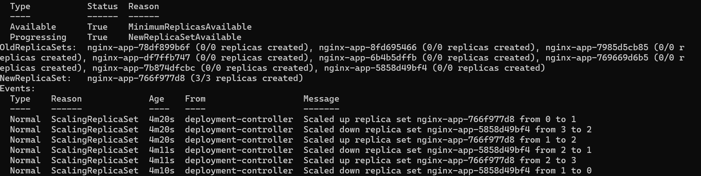

# Terraform Kubernetes CI/CD Deployment Platform
 
## Overview

This project demonstrates a complete cloud-native application deployment workflow using modern DevOps practices.

The project implements a containerized web application deployment using Docker, Kubernetes, Terraform, and GitHub Actions CI/CD automation.

The application is packaged into a Docker image, deployed into a Kubernetes cluster using Terraform-managed infrastructure, and continuously validated through an automated GitHub Actions pipeline.

The infrastructure is defined as code, allowing Kubernetes resources to be created, updated, and managed in a repeatable and version-controlled way.

The CI/CD workflow automatically performs Terraform validation, Docker image build verification, and Kubernetes configuration checks whenever changes are pushed to the repository.

This project represents a practical DevOps workflow covering application containerization, infrastructure automation, orchestration, and continuous integration practices.
---

## Technologies Used

- Terraform
- Kubernetes
- Docker
- Minikube
- GitHub Actions
- Nginx
- Linux
- Git

---

## Project Architecture

Developer

↓

GitHub Repository

↓

GitHub Actions CI/CD Pipeline

↓

Docker Image Build

↓

Terraform Infrastructure Management

↓

Kubernetes Deployment

↓

Running Application

---

## Project Structure

terraform-kubernetes-cicd/

├── app/

│   ├── Dockerfile

│   └── index.html

├── terraform/

│   ├── main.tf

│   ├── provider.tf

│   ├── variables.tf

│   ├── outputs.tf

│   └── versions.tf

├── kubernetes/

├── .github/

│   └── workflows/

│       └── deploy.yml

├── screenshots/

│   ├── application-running-browser.png

│   ├── kubernetes-pods-running.png

│   ├── minikube-status-and-service-url.png

│   ├── Kubernetes-deployment-details-1.png

│   └── Kubernetes-deployment-details-2.png

├── README.md

└── .gitignore

---

# Application Containerization

The application is packaged using Docker.

The Docker image contains the Nginx web server and the application HTML file.

Docker allows the application to run consistently across different environments.

Build image:

docker build -t terraform-k8s-app:v4 .

The image is then loaded into Minikube and deployed through Kubernetes.

---

# Terraform Infrastructure as Code

Terraform is used to provision and manage Kubernetes resources.

Instead of manually creating Kubernetes objects, Terraform defines the infrastructure in configuration files.

Terraform manages:

- Kubernetes Namespace
- Kubernetes Deployment
- Kubernetes Service

Benefits:

- Infrastructure is version controlled
- Deployments are repeatable
- Changes can be tracked
- Manual configuration is reduced

---

# Kubernetes Deployment

The application is deployed using Kubernetes Deployment.

The deployment provides:

- 3 replicas
- RollingUpdate strategy
- Container health checks
- Resource management

The application runs with multiple pods to improve availability.

Check pods:

kubectl get pods -n devops

---

# Kubernetes Production Improvements

## Rolling Update Strategy

The deployment uses RollingUpdate.

This allows application updates without completely stopping the service.

Benefits:

- Reduced downtime
- Safer deployments
- Controlled releases

## Readiness Probe

The readiness probe checks if the application is ready before receiving traffic.

Kubernetes only sends traffic to healthy containers.

## Liveness Probe

The liveness probe checks if the application is still running.

If the container becomes unhealthy, Kubernetes can restart it automatically.

## Resource Management

The container has resource settings.

Requests:

CPU: 100m

Memory: 128Mi

Limits:

CPU: 250m

Memory: 256Mi

This helps Kubernetes manage system resources efficiently.

---

# CI/CD Pipeline

GitHub Actions is used to automate the development workflow.

The workflow runs automatically when changes are pushed.

Pipeline steps:

1. Checkout repository

2. Setup Terraform

3. Terraform format validation

4. Terraform initialization

5. Terraform validation

6. Docker image build test

7. Kubernetes configuration validation

Workflow file:

.github/workflows/deploy.yml

---

---

# CI/CD Pipeline Execution Result

The GitHub Actions workflow was successfully executed after pushing changes to the main branch.

The pipeline automatically performed:

- Terraform formatting validation
- Terraform initialization
- Terraform configuration validation
- Docker image build verification
- Kubernetes Terraform configuration validation

All workflow jobs completed successfully, confirming that the project configuration can be tested automatically through CI/CD.

## GitHub Actions Successful Run

---
# Deployment Process

## Start Minikube

minikube start

## Build Docker Image

docker build -t terraform-k8s-app:v4 .

## Load Image Into Minikube

minikube image load terraform-k8s-app:v4

## Deploy Using Terraform

cd terraform

terraform apply

## Verify Kubernetes Deployment

kubectl get pods -n devops

## Check Deployment Details

kubectl describe deployment nginx-app -n devops

## Access Application

minikube service nginx-service -n devops --url

---

# Verification

The deployment was successfully tested.

Verified:

- Terraform managed Kubernetes resources
- Docker container running
- Kubernetes pods running
- Kubernetes service working
- Application accessible from browser
- CI/CD workflow created

---

# Screenshots

## Application Running In Browser

## Kubernetes Pods Running

## Minikube Status And Service URL

## Kubernetes Production Deployment Details

---

# Challenges Solved

During development, real DevOps issues were solved.

Examples:

- Docker image loading into Minikube
- Kubernetes deployment updates
- Terraform provider configuration
- Service accessibility testing
- Container deployment troubleshooting

---

# Future Improvements

Planned improvements:

- Deploy to AWS EKS
- Add Terraform modules
- Add AWS networking
- Add Load Balancer
- Add monitoring with Prometheus and Grafana
- Add centralized logging
- Add secrets management
- Build production cloud deployment

---

# Author

David Onwuka

DevOps / Cloud Engineering Portfolio Project
